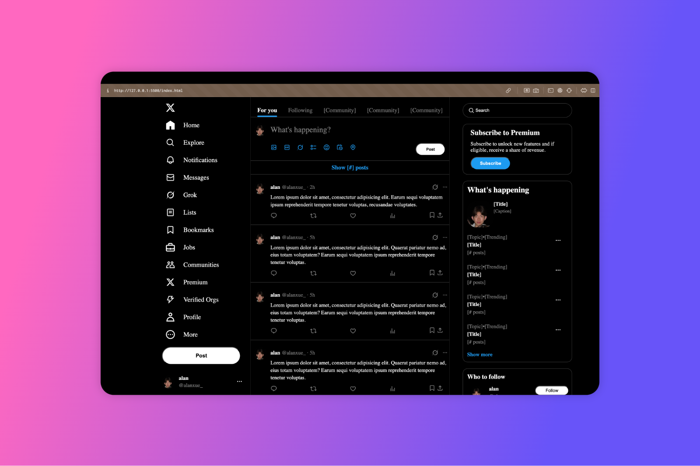

# X UI Clone

A recreation of Twitter/X's user interface built with HTML and SCSS. This project is a front-end practice exercise focusing on responsive design, component styling, and layout techniques without JavaScript functionality.


## Project Goals

- Master advanced CSS/SCSS techniques including flexbox and grid layouts
- Practice creating a complex, multi-column responsive interface
- Implement detailed UI components like sidebar navigation, user profiles, and content cards
- Learn proper SCSS organization using partials (_left-sidebar.scss, _right-sidebar.scss)


## How to Run

1. Clone this repository:
   ```
   git clone https://github.com/alanxue1/x-interface-clone.git
   ```
2. Open `index.html` in your browser to view the interface


## Screenshots



---

*This is a learning project created for educational purposes only. All trademarks belong to their respective owners.*